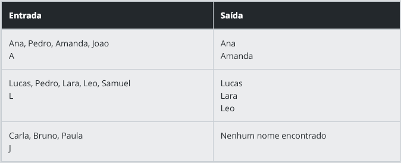

### Descrição
Uma empresa está desenvolvendo um sistema para triagem de candidatos. O objetivo é filtrar nomes que comecem com uma letra específica informada. Você deve implementar um algoritmo que receba uma lista de nomes em uma única linha (separados por vírgula) e uma letra, e retorne apenas os nomes que começam com essa letra.

### Entrada
A entrada deve conter:
Uma linha com os nomes separados por vírgula e espaço (ex: Ana, Pedro, Amanda)
Uma linha com a letra usada como filtro

### Saída
O programa deve exibir os nomes que começam com a letra fornecida. Se nenhum nome corresponder, exibir "Nenhum nome encontrado".

### Exemplos
A tabela abaixo apresenta exemplos com alguns dados de entrada e suas respectivas saídas esperadas. Certifique-se de testar seu programa com esses exemplos e com outros casos possíveis.

### Atenção:

É extremamente importante que as entradas e saídas sejam exatamente iguais às descritas na descrição do desafio de código.