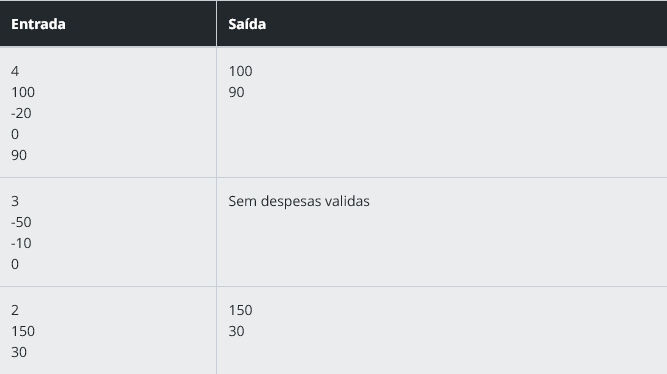

### Descrição

Em uma empresa de soluções financeiras, os dados de despesas são recebidos diariamente para análise. No entanto, somente despesas com valores positivos devem ser consideradas válidas para o relatório. Sua tarefa é criar um programa que filtre apenas essas despesas.

### Entrada
A entrada deve conter a quantidade total de despesas registradas, seguida dos valores (inteiros) de cada uma.

O primeiro valor representa o número total de despesas.
Os valores seguintes representam cada despesa registrada.
Saída
Deverá exibir apenas os valores válidos (maiores que zero), um por linha. Caso nenhuma despesa válida seja encontrada, exibir “Sem despesas validas”.

### Exemplos
A tabela abaixo apresenta exemplos com alguns dados de entrada e suas respectivas saídas esperadas. Certifique-se de testar seu programa com esses exemplos e com outros casos possíveis.

Atenção: É extremamente importante que as entradas e saídas sejam exatamente iguais às descritas na descrição do desafio de código.