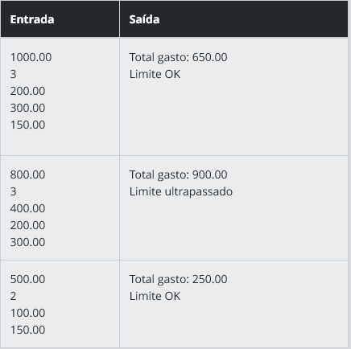

# Controle de Limite do Cartão Corporativo

### Descrição

Você está desenvolvendo um sistema de controle de despesas para cartões corporativos usados por funcionários. Cada funcionário possui um limite mensal e pode fazer diversas transações. O sistema deve informar se o funcionário está dentro do limite ou se ultrapassou o valor permitido.

### Entrada
A entrada deve conter o limite do cartão (número decimal) e em seguida uma lista com os valores de cada transação feita no mês.

O primeiro valor representa o limite do cartão.
O segundo valor representa a quantidade de transações.
As próximas linhas contêm os valores das transações (uma por linha).

### Saída
Deverá retornar o total gasto e uma mensagem indicando se o limite foi ultrapassado ou não.

### Exemplos
A tabela abaixo apresenta exemplos com alguns dados de entrada e suas respectivas saídas esperadas. Certifique-se de testar seu programa com esses exemplos e com outros casos possíveis.

### Atenção:

É extremamente importante que as entradas e saídas sejam exatamente iguais às descritas na descrição do desafio de código.