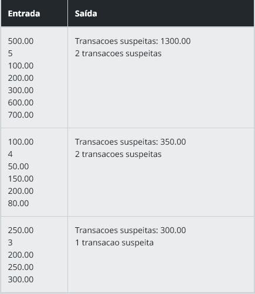

# Identificador de Transações Suspeitas

### Descrição
Uma empresa de análise financeira está desenvolvendo um sistema para identificar transações suspeitas com base em um valor limite. O objetivo do sistema é verificar se alguma transação ultrapassa o valor limite e marcá-la como suspeita. Se houver transações suspeitas, elas devem ser listadas. Caso contrário, o sistema deve informar que não há transações suspeitas. Além disso, o programa deve exibir o valor total das transações suspeitas e a quantidade de transações suspeitas.

### Entrada
A entrada deve conter:

O valor limite para transações suspeitas.
O número de transações a serem analisadas.
Os valores das transações (valores inteiros ou decimais).

### Saída
O programa deve exibir:

O valor total das transações que ultrapassam o limite.

O número de transações suspeitas.

Se nenhuma transação for suspeita, o programa deve exibir "Nenhuma transação suspeita".

### Exemplos

A tabela abaixo apresenta exemplos com alguns dados de entrada e suas respectivas saídas esperadas. Certifique-se de testar seu programa com esses exemplos e com outros casos possíveis.

### Atenção:

É extremamente importante que as entradas e saídas sejam exatamente iguais às descritas na descrição do desafio de código.